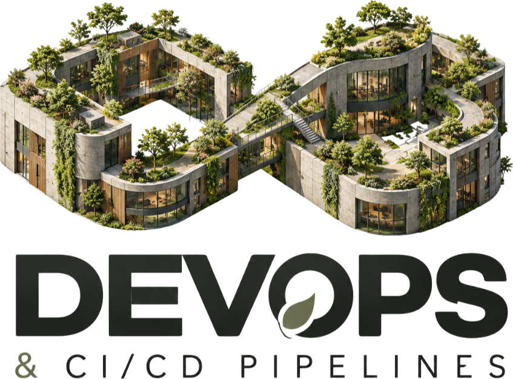

# 🏙️ DevOps CI/CD City

An interactive 3D WebGL isometric metropolis and architectural dashboard representing the complete Continuous Integration and Continuous Deployment (CI/CD) lifecycle.

Built with **React 19**, **Three.js**, **@react-three/fiber**, **@react-three/drei**, and **Vite**.

<p align="center">
  
</p>

> 🏆 **Presenting at a Hackathon?** Check out the [**Hackathon Pitch & Judge's Guide (HACKATHON.md)**](./HACKATHON.md) for the 30-second elevator pitch, 3-minute live demo walkthrough script, and judging criteria alignment!

---

## 🌟 Highlights

- **3D Interactive Isometric Metropolis**: Procedural architectural districts symbolizing each core stage of the DevOps pipeline.
- **Bi-directional Stage Inspection**: Click on any 3D district building, floating holographic label, or top pipeline navigation chips to trigger smooth cinematic camera fly-to transitions and open deep-dive telemetry cards.
- **Cinematic Controls**: Switch camera angles (Default Isometric, Top-Down Strategic Grid, Street Perspective, or Orbit) and toggle high-performance visual modes (Bloom post-processing, Day/Night lighting cycle).
- **Responsive HUD**: Glassmorphic terminal overlay with pipeline execution telemetry, logs, active runners, and health gauges.
- **Zero-Config Deployment**: Optimized for instant deployment on [Vercel](https://vercel.com).

---

## 🏗️ Districts & Pipeline Stages

| District | Pipeline Phase | Architectural Metaphor | Key Responsibilities |
|---|---|---|---|
| **Code Campus** | Stage 1: Source & Code | Multi-wing university campus with glass atrium | Git branching, PR reviews, linting, secrets detection |
| **Build Silos** | Stage 2: Build & Package | High-capacity industrial cylindrical silos & gantry cranes | Multi-arch Docker builds, compilation, caching |
| **Test Matrix** | Stage 3: Test & Validate | Stepped brutalist cleanroom with sensor arrays | Unit tests, E2E browser tests, security scanning (SAST/DAST) |
| **Deploy Gateways** | Stage 4: Release & Deploy | Futuristic orbital spaceport & launching pads | Canary releases, blue/green deployments, Kubernetes rollouts |
| **Monitor Citadel** | Stage 5: Observe & Operate | Monolithic telecommunications spire & radar dishes | OpenTelemetry, Prometheus metrics, anomaly alerts |

---

## 🚀 Quick Start

### Prerequisites
- Node.js (v18 or higher recommended)
- npm, pnpm, or yarn

### Installation
```bash
# Clone the repository
git clone https://github.com/ayanhackspro/devops-cicd-city.git

# Enter repository root
cd devops-cicd-city

# Install dependencies
npm install

# Launch local development server
npm run dev
```

Visit `http://localhost:5173` in your browser.

### Production Build
```bash
npm run build
```
The compiled, production-ready static assets will be located in `/dist`.

---

## 📂 Repository Structure

```text
.
├── docs/                     # DevOps CI/CD Prompt Pack & Architecture Specs
│   ├── 00_README.md          # Pack overview & index
│   ├── 01_POSTER.md          # DevOps isometric poster prompt
│   ├── 02_LOGO.md            # Modern logo & brand identity specifications
│   ├── 03_WEB_FRONTEND.md    # Frontend UI/UX specification
│   ├── 04_WEBGL_3D_CITY.md   # Three.js 3D city scene architecture
│   ├── 05_VISUAL_DIRECTION.md# Color palettes, lighting & materials guide
│   ├── 06_ANTIGRAVITY_MASTER.md # Antigravity multi-agent prompt system
│   ├── 07_IMAGE_PROMPTS.md   # Midjourney & Stable Diffusion prompts
│   └── DESIGN(2).md          # Extended design document
├── public/                   # Static assets & textures
├── src/
│   ├── components/
│   │   ├── ui/               # Glassmorphic HUD, DistrictCard, Header, Pipeline chips
│   │   └── webgl/            # Three.js Canvas, District 3D models, Fly-to CameraController
│   ├── data/                 # District definitions, stage details & metrics
│   ├── App.tsx               # Main application container
│   └── main.tsx              # Application entry point
├── index.html                # HTML entry point
├── package.json              # Project dependencies & scripts
├── tsconfig.json             # TypeScript configuration
├── vercel.json               # Vercel deployment configuration
└── vite.config.ts            # Vite bundler configuration
```

---

## ☁️ Deployment

### Deploy to Vercel
This repository is configured for immediate root deployment on Vercel:

1. Push your repository to GitHub.
2. Import the project into the [Vercel Dashboard](https://vercel.com/new).
3. Framework Preset: **Vite** (auto-detected).
4. Root Directory: `./` (default).
5. Click **Deploy**.

---

## 📄 License
MIT License. Created for the DevOps & Platform Engineering community.
